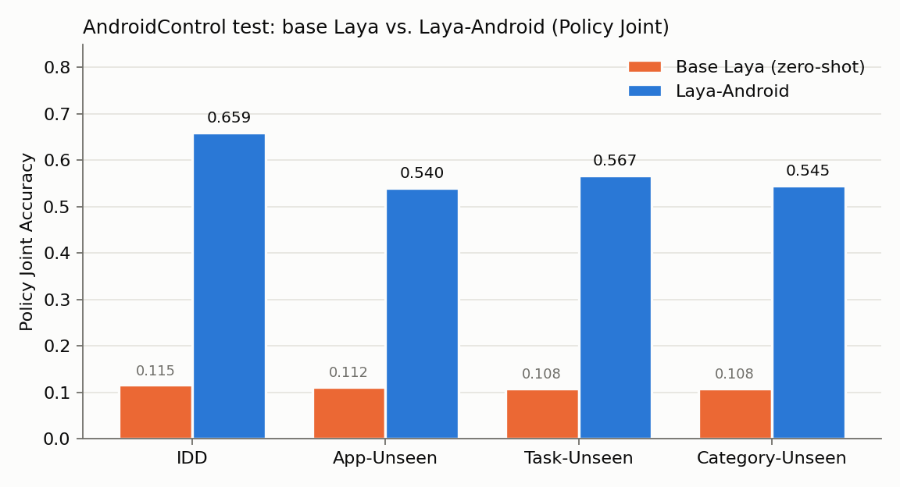
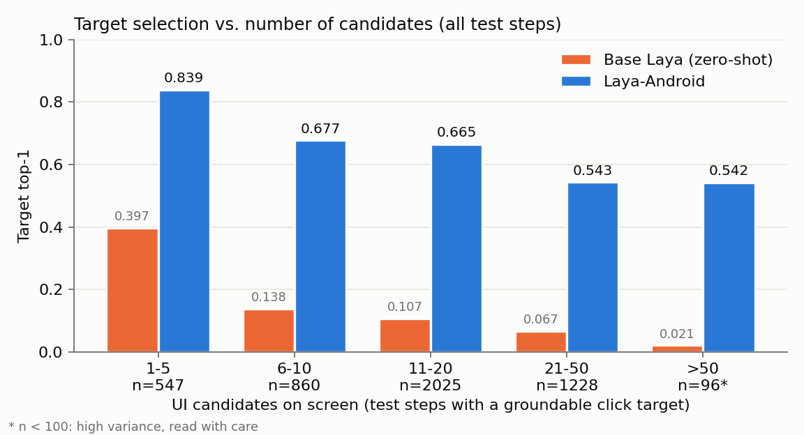
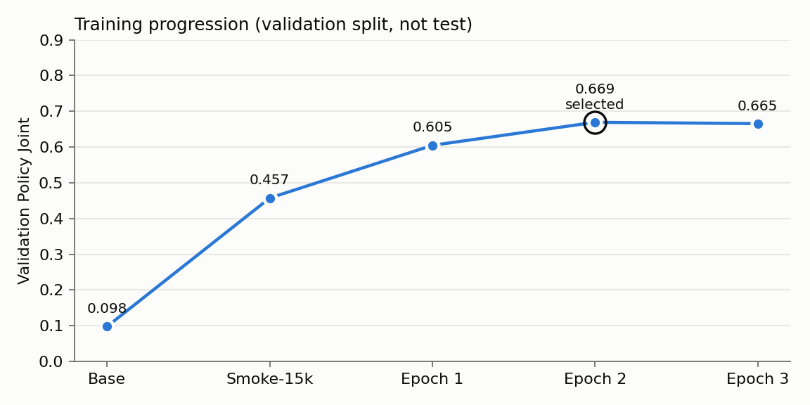

# Laya-Android

A 322M non-generative typed-decision policy for Android GUI action selection, fine-tuned on AndroidControl using accessibility-tree input only.

[Code (GitHub)](https://github.com/Byun11/laya-android) · [Evaluation protocol](https://github.com/Byun11/laya-android/blob/main/docs/eval_protocol.md)

**322M · no vision · 76.7 Type / 61.7 Grounding on AndroidControl-High · ~38 ms per decision (RTX 4090)**

| | Laya-Android |
|---|---:|
| Parameters | **322M** |
| Visual input | **None** (accessibility tree only) |
| Training data | AndroidControl train split only |
| AndroidControl-High Type | **76.7** |
| AndroidControl-High Grounding | **61.7** |
| Full Step SR | N/A (see below) |
| Median latency | **38.3 ms** (RTX 4090, batch 1) |

## What does it do?

At each step it reads the user goal, the last three actions and the actionable UI elements from the Android accessibility tree, and answers two questions in one forward pass: *which operation* and *which element*. It does not generate text and does not look at the screen image. It is a fine-tune of [Laya](https://huggingface.co/convaiinnovations/laya) by Convai Innovations; the architecture is Laya's, unchanged.

A real validation step (fixed selection rule, not hand-picked):

```text
Goal     find a nike casual shoes for women on the kicks crew app
History  INPUT_TEXT "casual shoes for women" → CLICK (WMNS) PUMA Oslo Maja … → CLICK Filter
UI       [0] Dismiss (View)  [1] FILTER Clear All … scroll  [2] - (Button)  [3] Clear All (View)
         [4] Brand (ImageView)  [5] Size And Type (ImageView)  [6] Release Year (ImageView)  … 16 total

operation   CLICK 0.935   WAIT 0.039   SCROLL_DOWN 0.012
target      [4] Brand 0.931   [7] Product Types 0.033   [5] Size And Type 0.008
gold        CLICK [4] Brand  ✓
```

## Quick start

```python
# pip install laya==0.3.28
import laya

agent = laya.load("ByunByun/laya-android")

OP_DESC = {"CLICK": "tap a UI element", "LONG_PRESS": "long-press a UI element", "SCROLL_UP": "scroll up",
           "SCROLL_DOWN": "scroll down", "SCROLL_LEFT": "scroll left", "SCROLL_RIGHT": "scroll right",
           "OPEN_APP": "launch an app by name", "INPUT_TEXT": "type text into the focused field",
           "BACK": "press the system back button", "HOME": "go to the home screen",
           "WAIT": "wait for the screen to update", "DONE": "the goal is complete; stop"}

goal = "Turn off Bluetooth"
history = ["OPEN_APP Settings"]                      # last 3 actions
candidates = ["Network & internet (LinearLayout)", "Connected devices (LinearLayout)", "Apps (LinearLayout)"]

state = {"goal": goal, "history": history, "ui": ["[%d] %s" % (i, c) for i, c in enumerate(candidates)]}
questions = {
    "operation": {"type": "choice", "instructions": "Which operation should be performed next?", "criteria": OP_DESC},
    "target": {"type": "choice", "instructions": "Which UI element should be targeted?",
               "criteria": {str(i): c for i, c in enumerate(candidates)}},
}
out = agent.system_one(state, questions, max_len=3072, head_max_len=1536)
print(out["answers"]["operation"]["choice"], out["answers"]["target"]["choice"])
```

Candidate labels must be built as in the repository's `src/candidates.py` / `src/serialization.py` (`"<text> (<class>) <flags>"`); other formats are out of distribution.

## Results

One evaluation of the frozen checkpoint (epoch 2, chosen on validation). Type and Grounding were computed from the saved predictions after the protocol was committed.

### AndroidControl-High (InfiGUI-R1 evaluator, 8444 steps / 1543 episodes)

| Model | Params | Input | Type | Grounding | Full SR |
|---|---:|---|---:|---:|---:|
| InfiGUI-R1-3B† | 3B | Screenshot | 82.7 | 74.4 | 71.1 |
| Laya base (zero-shot) | 322M | Accessibility tree | 29.0 | 11.8 | N/A |
| **Laya-Android** | **322M** | **Accessibility tree** | **76.7** | **61.7** | **N/A** |

† Reported by the authors ([InfiGUI-R1](https://github.com/InfiXAI/InfiGUI-R1), arXiv:2504.14239); not reproduced by us. Same evaluator and test set as ours.

Laya-Android selects actions from accessibility-derived UI candidates rather than predicting arbitrary screen coordinates; the gold boxes also come from the accessibility tree. 6.4% of test click/long-press targets (327 / 5,083) are outside our candidate set and count as misses. Full Step SR is not reported because v0 does not generate `INPUT_TEXT` text or `OPEN_APP` app names. AndroidControl-Low is not evaluated: v0 was trained with the high-level goal only.

### Base Laya → Laya-Android (Policy Joint Accuracy, test)

| Split | Base Laya | Laya-Android | Δ |
|---|---:|---:|---:|
| IDD | 0.115 | **0.659** | +54.4pt |
| App-Unseen | 0.112 | **0.540** | +42.8pt |
| Task-Unseen | 0.108 | **0.567** | +45.9pt |
| Category-Unseen | 0.108 | **0.545** | +43.7pt |



Policy Joint = operation correct and, for clicks, the chosen element is the gold element. It is an internal metric, not AndroidControl SR.

### Target top-1 by candidate count (union of test steps)

| Candidates | n | Base Laya | Laya-Android |
|---|---:|---:|---:|
| 1-5 | 547 | 0.397 | 0.839 |
| 6-10 | 860 | 0.138 | 0.677 |
| 11-20 | 2025 | 0.107 | 0.665 |
| 21-50 | 1228 | 0.067 | 0.543 |
| >50 | 96 | 0.021 | 0.542 |



### Latency (NVIDIA GeForce RTX 4090)

| Params | dtype | Batch | Median | p90 | p95 | Mean | End-to-end median | Peak VRAM (bs1) | Throughput (bs32) |
|---:|---|---:|---:|---:|---:|---:|---:|---:|---:|
| 322M | bf16 autocast | 1 | 38.3 ms | 41.2 ms | 42.7 ms | 38.0 ms | 42.8 ms | 1.66 GB | 64 steps/s |

### Training progression (validation Policy Joint)

| Checkpoint | Val Policy Joint |
|---|---:|
| Base | 0.098 |
| Smoke-15k | 0.457 |
| Epoch 1 | 0.605 |
| Epoch 2 (selected) | 0.669 |
| Epoch 3 | 0.665 |



Per-split Type / Grounding, operation recall and failure examples: see the [GitHub README](https://github.com/Byun11/laya-android#failure-analysis).

## Model details

| | |
|---|---|
| Developed by | Jaeyeon Byun (GitHub: Byun11) |
| Model type | Non-generative typed-decision model (bidirectional encoder + option-marker decision head) |
| Base model | `convaiinnovations/laya`, subfolder `multilingual`, revision `7b928d828b7b0e022f929d9bd2e44165aa270148` (mmBERT-base encoder) |
| Parameters | ~322M |
| Sequence budget | `max_len` 3072, `head_max_len` 1536 |
| License | Apache-2.0 |

## Intended use

- Research on lightweight Android GUI action-selection policies
- Accessibility-based mobile agents, e.g. a fast step selector under a planner
- Fast System-1 style decision models

## Out-of-scope use

- Operating real devices or accounts unsupervised, especially payments, messaging, account or security settings, or other irreversible actions
- Tasks that need visual understanding (images, canvases, games, custom-drawn UI)
- Generating text: `INPUT_TEXT` content and `OPEN_APP` names are not produced
- Claims of end-to-end task success: v0 is evaluated offline, step by step

## Training

AndroidControl only, official splits: 13,594 train episodes / 74,714 actions (9 zero-action episodes excluded), plus a synthetic `DONE` per episode → 88,308 steps, 132,448 training items. Supervised fine-tuning (cross-entropy over options) with `laya.train`, bf16, effective batch 32, encoder lr 2.5e-5, head lr 1e-4, option order shuffled, 3 epochs on one RTX 4090 (2.7 h). No RL, no oversampling, no class weights, no candidate truncation. Checkpoint chosen by validation Policy Joint; temperatures fit on validation.

## Limitations

- **No visual input.** Unlabeled icons, canvases and custom-drawn UI are hard or impossible to distinguish.
- **Candidate coverage.** 92.3–95.2% of test click targets are covered by the candidate extractor; the rest are unrecoverable.
- **Generalization gap.** Policy Joint drops 9–12 points from IDD to unseen apps, tasks and categories.
- **No text or app-name generation**, hence no Full Step SR.
- **Weak rare actions.** WAIT, BACK, horizontal scroll and LONG_PRESS have low recall.
- **Offline benchmark only.** Step-by-step with gold history; not a measured task success rate.

## Ethical and safety considerations

- A GUI action model can trigger real side effects. Keep a human in the loop and gate sensitive or irreversible actions.
- Accessibility trees can contain personal data shown on screen. Process them locally and avoid logging them.
- Calibrated confidence can support abstention, but it does not guarantee correctness.
- Training data covers a limited set of apps and locales.

## Citation

```bibtex
@software{laya_android_2026,
  title   = {Laya-Android},
  author  = {Byun, Jaeyeon},
  year    = {2026},
  version = {0.1.0},
  url     = {https://github.com/Byun11/laya-android}
}
```

Please also cite AndroidControl (Li et al., 2024, arXiv:2406.03679) and Laya.

## Acknowledgements

- Built on top of [Laya](https://github.com/NandhaKishorM/laya) by Convai Innovations (Apache-2.0). Not affiliated with or endorsed by Convai Innovations.
- Encoder: [mmBERT-base](https://huggingface.co/jhu-clsp/mmBERT-base) (MIT).
- Data: [AndroidControl](https://github.com/google-research/google-research/tree/master/android_control) by Google Research (Apache-2.0).
- Evaluator: [InfiGUI-R1](https://github.com/InfiXAI/InfiGUI-R1) (Apache-2.0).
