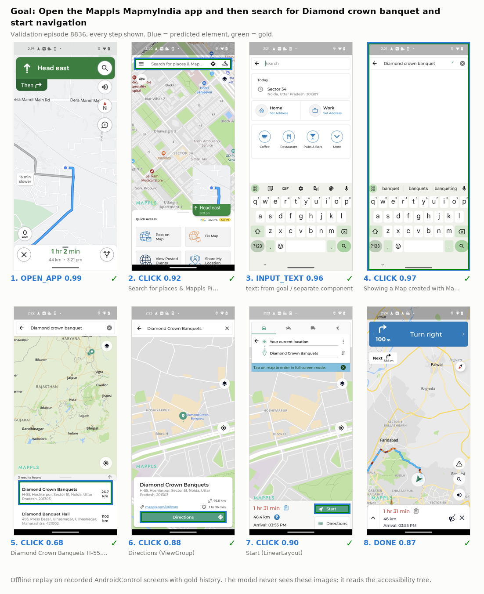

# Laya-Android

[](https://huggingface.co/ByunByun/laya-android)
[](LICENSE)
[](https://huggingface.co/convaiinnovations/laya)
[](docs/training.md)
[](docs/eval_protocol.md)

A 322M typed-decision policy for Android GUI control.
Accessibility tree only · no vision · no autoregressive generation.

| Parameters | AndroidControl-High Type | AndroidControl-High Grounding | Latency (RTX 4090, bs1) |
|:---:|:---:|:---:|:---:|
| **322M** | **76.7** | **61.7** | **~40 ms** |



Every step of a recorded validation episode (chosen by a fixed rule) with Laya-Android's predictions: blue = predicted element, green = gold. The model never sees the screenshots; it reads the accessibility tree. Gold history, not a live run. An episode with a failure: [docs/results.md](docs/results.md#examples-validation).

Given a goal, the last three actions and the actionable UI elements of the Android accessibility tree, Laya-Android picks the next operation and the target element in one forward pass. It is a fine-tune of [Laya](https://github.com/NandhaKishorM/laya) by Convai Innovations, trained only on AndroidControl.

## Results

### Against Jev, the hosted decision model with the same API

Same task form as Laya-Android: typed choice questions answered with probabilities. Both models received byte-identical requests (state + operation and target questions) on the same 1,000 AndroidControl-High test steps.

<!-- table: Laya-Android vs Jev (same 1,000 test steps) -->
| | Laya-Android (322M, local) | Jev 1.13.0 (TypeSafe API) |
|---|---:|---:|
| Type | **77.2** | 67.2 |
| Grounding | **62.8** | 56.7 |
| Operation ECE (lower is better) | **0.037** | 0.066 |
| Operation Brier (lower is better) | **0.338** | 0.487 |
| Target ECE (lower is better) | **0.061** | 0.140 |
| Median latency | **39 ms** (RTX 4090) | 236 ms (API round trip) |
<!-- /table -->


Reliability diagram: when a model says it is 80% sure, it should be right 80% of the time (the diagonal). Jev 1.13.0 was called through the TypeSafe API on 2026-10-07; it is a general decision model, not trained on AndroidControl. Jev is not fully deterministic: an earlier run with the same requests gave Type 67.6, Grounding 56.4 and operation ECE 0.055 (raw: [`results/baselines/`](results/baselines/)).

### Against generative LLMs with the same input


Same 1,000 test steps, same input (goal, last 3 actions, the same accessibility candidates), same InfiGUI-R1 judge, one RTX 4090 at batch 1. The LLMs are used zero-shot (not trained on AndroidControl), thinking disabled, and asked for a JSON action; vLLM runs them in bf16, Ollama in 4-bit GGUF. The gap in latency comes from selecting instead of generating; the gap in accuracy also reflects that only Laya-Android was trained on this dataset.

<details>
<summary>All 16 models</summary>

<!-- table: Same-input comparison (1,000 test steps) -->
| Model | Params | Serving | Type | Grounding | Median latency | p95 | vs Laya-Android |
|---|---|---|---:|---:|---:|---:|---:|
| **Laya-Android** | 322M | Laya-Android (local) | **77.2** | **62.8** | **39 ms** | 48 ms | 1x |
| Qwen3.8 27B | 27B (Q4_K_M) | Ollama GGUF | 76.8 | 64.5 | 575 ms | 694 ms | 14.9x slower |
| Qwen3.5 4.2B | 4.2B (Q4_K_M) | Ollama GGUF | 67.3 | 52.8 | 193 ms | 252 ms | 5.0x slower |
| jev-1.13.0 | undisclosed | TypeSafe API | 67.2 | 56.7 | 236 ms | 295 ms | 6.1x slower |
| Qwen3.5 4B | 4B (bf16) | vLLM bf16 | 67.1 | 50.5 | 242 ms | 305 ms | 6.3x slower |
| Gemma 4 25B | 25B (Q4_K_M) | Ollama GGUF | 64.8 | 56.6 | 201 ms | 256 ms | 5.2x slower |
| Qwen3.5 9.7B | 9.7B (Q4_K_M) | Ollama GGUF | 63.6 | 51.6 | 229 ms | 273 ms | 5.9x slower |
| Gemma 4 E2B | E2B (bf16) | vLLM bf16 | 58.4 | 23.6 | 155 ms | 210 ms | 4.0x slower |
| Qwen3.5 2B | 2B (bf16) | vLLM bf16 | 57.5 | 23.0 | 149 ms | 202 ms | 3.9x slower |
| Gemma 4 8.0B | 8.0B (Q4_K_M) | Ollama GGUF | 57.4 | 45.0 | 171 ms | 202 ms | 4.4x slower |
| Qwen3.5 1.9B | 1.9B (Q8_0) | Ollama GGUF | 57.4 | 24.5 | 126 ms | 144 ms | 3.3x slower |
| Gemma 4 E4B | 7.5B (Q4_K_M) | Ollama GGUF | 57.1 | 44.1 | 146 ms | 175 ms | 3.8x slower |
| Gemma 4 E2B | 4.6B (Q4_K_M) | Ollama GGUF | 56.9 | 22.7 | 116 ms | 139 ms | 3.0x slower |
| Ministral 3 14B | 14B (Q4_K_M) | Ollama GGUF | 53.2 | 42.0 | 285 ms | 424 ms | 7.4x slower |
| Qwen3.5 0.8B | 0.8B (Q8_0) | Ollama GGUF | 41.3 | 0.0 | 124 ms | 158 ms | 3.2x slower |
| Qwen3.5 0.8B | 0.8B (bf16) | vLLM bf16 | 40.9 | 0.4 | 125 ms | 178 ms | 3.2x slower |
<!-- /table -->

</details>

### Full test set, official evaluator

AndroidControl-High, 8,444 test steps / 1,543 episodes, public [InfiGUI-R1 evaluator](https://github.com/InfiXAI/InfiGUI-R1), evaluated once with the checkpoint frozen on validation ([protocol](docs/eval_protocol.md)):

<!-- table: AndroidControl-High: base vs fine-tuned (official evaluator) -->
| Model | Params | Type | Grounding | Full SR |
|---|---:|---:|---:|---:|
| Laya base (zero-shot) | 322M | 29.0 | 11.8 | N/A |
| **Laya-Android** | **322M** | **76.7** | **61.7** | **N/A** |
| Δ | | +47.6 | +49.9 | |
<!-- /table -->

Full SR is N/A: it requires generated text and app names, which v0 does not produce. Screenshot-based VLMs on the same evaluator report higher numbers (e.g. InfiGUI-R1-3B: 82.7 Type / 74.4 Grounding) but solve a different task (pixel coordinates instead of choosing among accessibility candidates). Per-split results including unseen apps, tasks and categories: [docs/results.md](docs/results.md).

## Efficiency

<!-- table: Latency -->
| Hardware | Precision | Median | p95 | Peak VRAM |
|---|---|---:|---:|---:|
| RTX 4090 | bf16 autocast | 39.7 ms | 43.5 ms | 1.66 GB |
<!-- /table -->


Latency stays near 40 ms up to 50 candidates and 1,024 input tokens. Batch sweep and length scaling: [docs/benchmark.md](docs/benchmark.md).

## Quick start

```bash
git clone https://github.com/Byun11/laya-android && cd laya-android
pip install -r requirements.txt
python examples/quickstart.py        # loads ByunByun/laya-android
```

```python
import laya
from serialization import OP_DESC, Q_OP, Q_TARGET   # src/serialization.py

agent = laya.load("ByunByun/laya-android")
state = {"goal": goal, "history": last_3_actions, "ui": ["[%d] %s" % (i, c) for i, c in enumerate(candidates)]}
questions = {
    "operation": {"type": "choice", "instructions": Q_OP, "criteria": OP_DESC},
    "target": {"type": "choice", "instructions": Q_TARGET, "criteria": {str(i): c for i, c in enumerate(candidates)}},
}
out = agent.system_one(state, questions, max_len=3072, head_max_len=1536)
out["answers"]["operation"]["choice"], out["answers"]["target"]["choice"]   # ('CLICK', '4')
```

Build candidates with [`src/candidates.py`](src/candidates.py); other label formats are out of distribution.

## Limitations

- No visual input: unlabeled icons and custom-drawn UI are hard to tell apart.
- No text or app-name generation, so no Full Step SR; AndroidControl-Low not evaluated.
- Policy Joint drops 9–12 points on unseen apps, tasks and categories.
- Weak on rare actions (WAIT, BACK, horizontal scroll, LONG_PRESS).
- Offline, step-level benchmark with gold history; not an autonomous task success rate.

## More

| | |
|---|---|
| [docs/results.md](docs/results.md) | per-split results, strict grounding, operation recall, examples, training progression, related work |
| [docs/benchmark.md](docs/benchmark.md) | same-input comparison details, latency by candidates, input length and batch size |
| [docs/training.md](docs/training.md) | model diagram, data, candidate extraction, input format, actions, training, reproduction |
| [docs/eval_protocol.md](docs/eval_protocol.md) | evaluation protocol, frozen before scoring |

## Citation

```bibtex
@software{laya_android_2026,
  title   = {Laya-Android},
  author  = {Byun, Jaeyeon},
  year    = {2026},
  version = {0.3.0},
  url     = {https://github.com/Byun11/laya-android}
}
```

Built on [Laya](https://github.com/NandhaKishorM/laya) (Convai Innovations, Apache-2.0; not affiliated), [mmBERT-base](https://huggingface.co/jhu-clsp/mmBERT-base) (MIT) and [AndroidControl](https://github.com/google-research/google-research/tree/master/android_control) (Google Research, Apache-2.0). Evaluator: [InfiGUI-R1](https://github.com/InfiXAI/InfiGUI-R1) (Apache-2.0). Licensed Apache-2.0, see [LICENSE](LICENSE) and [NOTICE](NOTICE).
