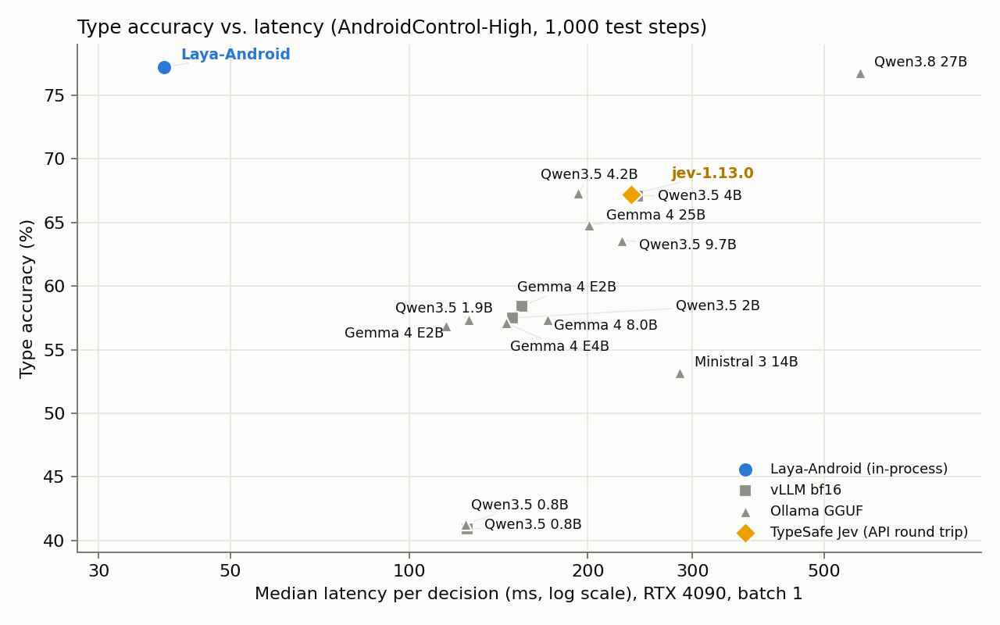
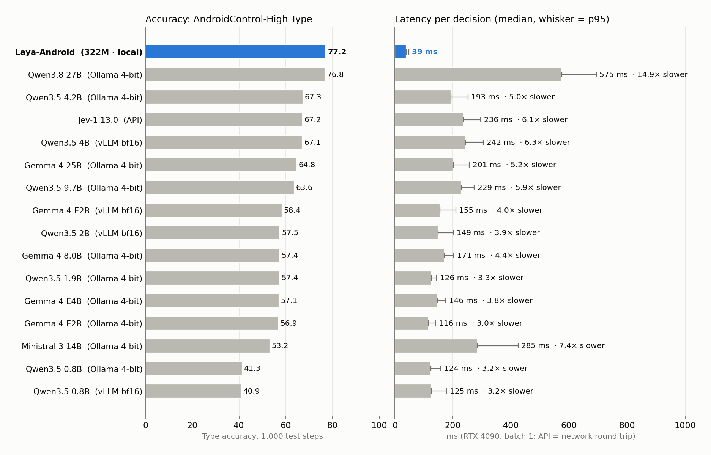
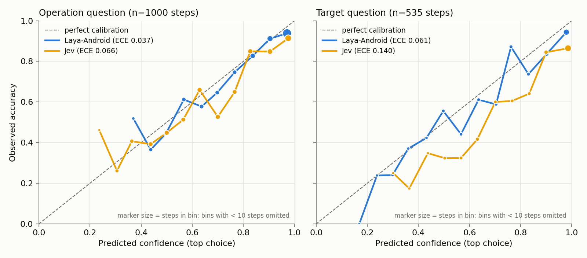

# Efficiency benchmark

Script: [`scripts/benchmark_latency.py`](../scripts/benchmark_latency.py). Raw data: [`results/latency/rtx4090.json`](../results/latency/rtx4090.json).

Protocol: one RTX 4090 24GB, fp32 weights with bf16 autocast, CUDA-synchronized timing. 100 warm-up and 1,000 measured steps sampled (seed 0) from test_idd inputs; labels are not used. One decision asks the operation question and the target question over all candidates in a single forward pass. Data loading is excluded; "end-to-end" adds tokenization. Software: laya 0.3.28, transformers 4.57.6, torch 2.14.1+cu130.

## Interactive latency (batch 1)

<!-- table: Latency -->
| Hardware | Precision | Median | p95 | Peak VRAM |
|---|---|---:|---:|---:|
| RTX 4090 | bf16 autocast | 39.7 ms | 43.5 ms | 1.66 GB |
<!-- /table -->

End-to-end median including tokenization: see `e2e_ms` in the raw file. A previous run of the same script gave a 38.3 ms median; expect ±1–2 ms between runs.

## By number of candidates

<!-- table: Latency by candidate count (batch 1) -->
| Candidates | n | Median | p95 |
|---|---:|---:|---:|
| 1-5 | 102 | 39.7 ms | 42.1 ms |
| 6-10 | 171 | 39.5 ms | 42.1 ms |
| 11-20 | 406 | 39.6 ms | 41.5 ms |
| 21-50 | 295 | 40.3 ms | 43.9 ms |
| >50 | 21 | 49.0 ms | 78.6 ms |
<!-- /table -->

## By input length

<!-- table: Latency by input length (batch 1, longest sequence of the step) -->
| Input tokens | n | Median | p95 |
|---|---:|---:|---:|
| <=512 | 649 | 39.6 ms | 41.8 ms |
| 513-1024 | 292 | 39.9 ms | 42.5 ms |
| 1025-1536 | 49 | 42.9 ms | 48.4 ms |
| >1536 | 10 | 53.1 ms | 105.5 ms |
<!-- /table -->

Latency is flat up to ~1,024 tokens: at batch 1 the forward pass is dominated by fixed overhead, not sequence length.

## By batch size

<!-- table: Batch size (steps per forward, inputs unsorted) -->
| Batch | Median batch latency | p95 | Throughput | Peak VRAM allocated | Peak VRAM reserved |
|---:|---:|---:|---:|---:|---:|
| 1 | 39.1 ms | 42.3 ms | 25.3 steps/s | 1.66 GB | 1.91 GB |
| 4 | 40.0 ms | 67.4 ms | 90.4 steps/s | 2.30 GB | 3.45 GB |
| 8 | 71.3 ms | 158.1 ms | 98.7 steps/s | 3.16 GB | 6.30 GB |
| 16 | 177.9 ms | 371.3 ms | 80.2 steps/s | 4.89 GB | 11.99 GB |
| 32 | 431.1 ms | 827.8 ms | 58.3 steps/s | 8.34 GB | 23.35 GB |
<!-- /table -->

Throughput peaks around batch 8. Larger batches lose throughput because every step in a batch is padded to the longest one (inputs are not length-sorted here); length bucketing would help offline serving.

## Same-input comparison

Scripts: [`bench_vllm.py`](../scripts/bench_vllm.py), [`bench_ollama.py`](../scripts/bench_ollama.py), [`bench_jev.py`](../scripts/bench_jev.py), [`bench_llm_baselines.py`](../scripts/bench_llm_baselines.py) (`--laya`). Raw: [`results/baselines/`](../results/baselines/).

<!-- table: Same-input comparison (1,000 test steps) -->
| Model | Params | Serving | Type | Grounding | Median latency | p95 | vs Laya-Android |
|---|---|---|---:|---:|---:|---:|---:|
| **Laya-Android** | 322M | Laya-Android (local) | **77.2** | **62.8** | **39 ms** | 48 ms | 1x |
| Qwen3.8 27B | 27B (Q4_K_M) | Ollama GGUF | 76.8 | 64.5 | 575 ms | 694 ms | 14.9x slower |
| Qwen3.5 4.2B | 4.2B (Q4_K_M) | Ollama GGUF | 67.3 | 52.8 | 193 ms | 252 ms | 5.0x slower |
| jev-1.13.0 | undisclosed | TypeSafe API | 67.2 | 56.7 | 236 ms | 295 ms | 6.1x slower |
| Qwen3.5 4B | 4B (bf16) | vLLM bf16 | 67.1 | 50.5 | 242 ms | 305 ms | 6.3x slower |
| Gemma 4 25B | 25B (Q4_K_M) | Ollama GGUF | 64.8 | 56.6 | 201 ms | 256 ms | 5.2x slower |
| Qwen3.5 9.7B | 9.7B (Q4_K_M) | Ollama GGUF | 63.6 | 51.6 | 229 ms | 273 ms | 5.9x slower |
| Gemma 4 E2B | E2B (bf16) | vLLM bf16 | 58.4 | 23.6 | 155 ms | 210 ms | 4.0x slower |
| Qwen3.5 2B | 2B (bf16) | vLLM bf16 | 57.5 | 23.0 | 149 ms | 202 ms | 3.9x slower |
| Gemma 4 8.0B | 8.0B (Q4_K_M) | Ollama GGUF | 57.4 | 45.0 | 171 ms | 202 ms | 4.4x slower |
| Qwen3.5 1.9B | 1.9B (Q8_0) | Ollama GGUF | 57.4 | 24.5 | 126 ms | 144 ms | 3.3x slower |
| Gemma 4 E4B | 7.5B (Q4_K_M) | Ollama GGUF | 57.1 | 44.1 | 146 ms | 175 ms | 3.8x slower |
| Gemma 4 E2B | 4.6B (Q4_K_M) | Ollama GGUF | 56.9 | 22.7 | 116 ms | 139 ms | 3.0x slower |
| Ministral 3 14B | 14B (Q4_K_M) | Ollama GGUF | 53.2 | 42.0 | 285 ms | 424 ms | 7.4x slower |
| Qwen3.5 0.8B | 0.8B (Q8_0) | Ollama GGUF | 41.3 | 0.0 | 124 ms | 158 ms | 3.2x slower |
| Qwen3.5 0.8B | 0.8B (bf16) | vLLM bf16 | 40.9 | 0.4 | 125 ms | 178 ms | 3.2x slower |
<!-- /table -->

Same 1,000 test steps (seed 0), same input (goal, last 3 actions, the same accessibility candidates), same InfiGUI-R1 judge, one RTX 4090 at batch 1. The generative models are used zero-shot (not trained on AndroidControl), thinking disabled, asked for a JSON action; vLLM runs them in bf16, Ollama in 4-bit GGUF. Jev is TypeSafe's hosted decision model (jev-1.13.0, measured 2026-10-07) and its latency is an API round trip. The comparison shows the speed of answering by selection versus generation; the accuracy gap also reflects that only Laya-Android was trained on this dataset.

The vLLM runs of Qwen3.5-9B, Gemma-4-E4B and LFM2.5-1.2B were not completed and are not reported; Qwen3.5-9B and Gemma-4-E4B are covered by the Ollama runs.

Jev 1.13.0 was measured twice with identical requests; the reported run saved per-step probabilities. Jev is not fully deterministic: an earlier run with the same requests gave Type 67.6, Grounding 56.4 and operation ECE 0.055 (raw: [`results/baselines/`](../results/baselines/)).

<!-- table: Calibration vs Jev (same 1,000 steps, operation question) -->
| Model | ECE (lower is better) | Brier (lower is better) |
|---|---:|---:|
| **Laya-Android** | **0.037** | **0.338** |
| jev-1.13.0 | 0.067 | 0.487 |
<!-- /table -->

Models other than those in the same-input comparison above were not timed on this hardware; no latency numbers from papers are compared.
