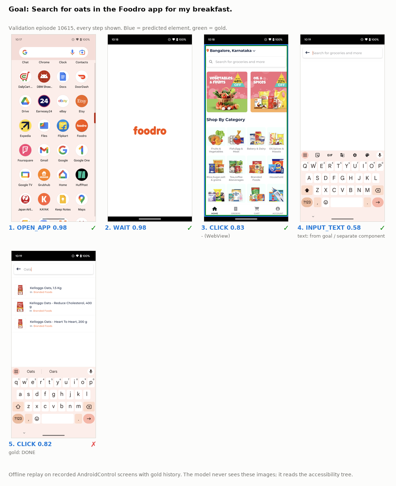

# Detailed results

All test numbers come from one evaluation of the frozen checkpoint (epoch 2, selected on validation). Type and Grounding use the InfiGUI-R1 evaluator and were computed from saved predictions after the [protocol](eval_protocol.md) was committed. Raw files: [`results/test/`](../results/test/).

## AndroidControl-High

<!-- table: AndroidControl-High: base vs fine-tuned (official evaluator) -->
| Model | Params | Type | Grounding | Full SR |
|---|---:|---:|---:|---:|
| Laya base (zero-shot) | 322M | 29.0 | 11.8 | N/A |
| **Laya-Android** | **322M** | **76.7** | **61.7** | **N/A** |
| Δ | | +47.6 | +49.9 | |
<!-- /table -->

### With an external reference

The external row solves a different task (screen coordinates from a screenshot) and is shown only as a reference point.

<!-- table: AndroidControl-High (InfiGUI-R1 evaluator, 8444 steps / 1543 episodes) -->
| Model | Params | Input | Type | Grounding | Full SR |
|---|---:|---|---:|---:|---:|
| InfiGUI-R1-3B† | 3B | Screenshot | 82.7 | 74.4 | 71.1 |
| Laya base (zero-shot) | 322M | Accessibility tree | 29.0 | 11.8 | N/A |
| **Laya-Android** | **322M** | **Accessibility tree** | **76.7** | **61.7** | **N/A** |
<!-- /table -->

† Reported by the authors ([InfiGUI-R1](https://github.com/InfiXAI/InfiGUI-R1), arXiv:2504.14239); not reproduced by us ([source](../results/external_baselines.json)). Laya-Android selects among accessibility-derived candidates instead of predicting free coordinates, and the gold boxes come from the same accessibility tree. 6.4% of test click/long-press targets (327 / 5,083) are outside the candidate set and count as misses. Full SR is N/A because v0 does not generate `INPUT_TEXT` text or `OPEN_APP` app names. AndroidControl-Low is not evaluated (v0 was trained with the high-level goal only).

### Stricter grounding (supplementary)

The reference Grounding rule accepts a click inside any of up to three gold boxes enlarged 1.2×, or within 4% of the screen from the gold point. For 22.7% of gold clicks the box list includes a container covering more than a quarter of the screen. Counting a click as correct only if it lies inside the **smallest** gold box (no enlargement, no radius) gives **55.2** instead of 61.7 for Laya-Android, computed from the same saved predictions. This is a property of the evaluator and applies to every model scored with it; the official number above is unchanged.

## Base Laya → Laya-Android

<!-- table: Base Laya → Laya-Android (Policy Joint Accuracy, test) -->
| Split | Base Laya | Laya-Android | Δ |
|---|---:|---:|---:|
| IDD | 0.115 | **0.659** | +54.4pt |
| App-Unseen | 0.112 | **0.540** | +42.8pt |
| Task-Unseen | 0.108 | **0.567** | +45.9pt |
| Category-Unseen | 0.108 | **0.545** | +43.7pt |
<!-- /table -->

## Per split

<!-- table: Per split (Laya-Android, test) -->
| Split | Steps | Type | Grounding | Policy Joint | Target top-1 | Op macro-F1 | Candidate coverage | ECE (op) |
|---|---:|---:|---:|---:|---:|---:|---:|---:|
| IDD | 3897 | 81.4 | 67.7 | 0.659 | 0.681 | 0.607 | 95.2% | 0.012 |
| App-Unseen | 3475 | 70.8 | 53.2 | 0.540 | 0.599 | 0.502 | 93.3% | 0.055 |
| Task-Unseen | 4464 | 72.8 | 56.5 | 0.567 | 0.629 | 0.515 | 92.3% | 0.045 |
| Category-Unseen | 3891 | 71.5 | 54.9 | 0.545 | 0.602 | 0.509 | 93.8% | 0.049 |
<!-- /table -->

## Target selection vs. number of candidates

<!-- table: Target top-1 by candidate count (union of test steps) -->
| Candidates | n | Base Laya | Laya-Android |
|---|---:|---:|---:|
| 1-5 | 547 | 0.397 | 0.839 |
| 6-10 | 860 | 0.138 | 0.677 |
| 11-20 | 2025 | 0.107 | 0.665 |
| 21-50 | 1228 | 0.067 | 0.543 |
| >50 | 96 | 0.021 | 0.542 |
<!-- /table -->

## Operation recall

<!-- table: Operation recall (test; n = gold support) -->
| Operation | IDD | App-Unseen | Task-Unseen | Category-Unseen |
|---|---:|---:|---:|---:|
| CLICK | 0.89 (n=2445) | 0.79 (n=2024) | 0.81 (n=2583) | 0.79 (n=2241) |
| LONG_PRESS | 0.22 (n=9) | – | – | – |
| SCROLL_UP | 0.55 (n=65) | 0.00 (n=22) | 0.06 (n=31) | 0.07 (n=30) |
| SCROLL_DOWN | 0.64 (n=412) | 0.57 (n=414) | 0.61 (n=527) | 0.62 (n=499) |
| SCROLL_LEFT | 0.13 (n=15) | 0.08 (n=26) | 0.04 (n=57) | 0.04 (n=47) |
| SCROLL_RIGHT | 0.28 (n=18) | 0.68 (n=66) | 0.62 (n=74) | 0.65 (n=71) |
| OPEN_APP | 0.94 (n=256) | 0.85 (n=243) | 0.88 (n=347) | 0.86 (n=280) |
| INPUT_TEXT | 0.87 (n=287) | 0.91 (n=243) | 0.90 (n=338) | 0.90 (n=268) |
| BACK | 0.56 (n=117) | 0.31 (n=211) | 0.32 (n=223) | 0.31 (n=215) |
| WAIT | 0.41 (n=273) | 0.30 (n=226) | 0.32 (n=284) | 0.31 (n=240) |
| DONE | 0.75 (n=721) | 0.56 (n=631) | 0.57 (n=803) | 0.55 (n=700) |
<!-- /table -->

Strong: CLICK, OPEN_APP, INPUT_TEXT. Weak: WAIT and BACK (often not inferable from the accessibility tree alone), horizontal scrolling, LONG_PRESS (157 training examples).

## Examples (validation)

Rule ([`scripts/pick_examples.py`](../scripts/pick_examples.py)): validation steps whose gold operation is CLICK, groundable, with 8–20 candidates; shuffled with seed 0; the first fully correct and the first incorrect step ([data](../results/val/examples.json)).

**Success.** Goal *"…find a nike casual shoes for women on the kicks crew app"*, history `INPUT_TEXT "casual shoes for women" → CLICK (WMNS) PUMA Oslo Maja … → CLICK Filter`, 16 candidates. Operation CLICK 0.935 (WAIT 0.039); target [4] Brand 0.931 ([7] Product Types 0.033). Gold: CLICK [4] Brand.

**Episode with a failure** (same fixed rule, first validation episode with at least one wrong and at least half correct steps): the last step should be DONE (results are already shown), but the model predicts another CLICK (0.82; DONE 0.08).

**Failure.** Goal *"increase the brightness for a clear view in the Moon+ Reader app"*, history `SCROLL_RIGHT → WAIT`. Of 18 candidates, 14 are unlabeled icons (`- (ImageView)`). The operation is right (CLICK 0.751), but the target is spread over the icons ([9] 0.127, [13] 0.096, gold [12] 0.083). Without the image there is nothing to tell them apart.

## Training progression (validation)

<!-- table: Training progression (validation Policy Joint) -->
| Checkpoint | Val Policy Joint |
|---|---:|
| Base | 0.098 |
| Smoke-15k | 0.457 |
| Epoch 1 | 0.605 |
| Epoch 2 (selected) | 0.669 |
| Epoch 3 | 0.665 |
<!-- /table -->

Epoch 2 was selected by validation Policy Joint before any test evaluation. Epoch 3 shows signs of overfitting (training loss drops in steps at epoch boundaries; uncalibrated validation ECE rises from 0.028 to 0.105).

## Related work

Text / accessibility-tree approaches on AndroidControl and similar data report different metrics, so their numbers are not tabulated next to ours:

- [AndroidControl](https://arxiv.org/abs/2406.03679) (Li et al., 2024): fine-tuned LLMs on accessibility-tree text; step accuracy that also requires typed text and app names, on a random IDD subset, high- and low-level instructions.
- [LiMAC](https://arxiv.org/abs/2410.17883): a small action transformer that selects the click target among UI-element embeddings; its own action-accuracy definition.
- [V-Droid](https://arxiv.org/abs/2503.15937): an 8B verifier scoring accessibility-derived candidate actions; reported on AndroidWorld (online task success), not AndroidControl.
- [MindAct](https://arxiv.org/abs/2306.06070): a small cross-encoder ranks candidate elements before an LLM acts (web, Mind2Web).
- [laya-browser](https://huggingface.co/cklxx/laya-browser): Laya fine-tuned for web operation + element selection.
- Screenshot VLMs ([InfiGUI-R1](https://github.com/InfiXAI/InfiGUI-R1), [OS-Atlas](https://arxiv.org/abs/2410.23218), UI-TARS, AgentCPM-GUI) report AndroidControl Low/High Type / Grounding / SR; evaluator variants differ (8,444 vs 7,708 steps, bbox-or-4% vs 14% click rule).

## Metrics

| Metric | Correct when | Comparable to other papers |
|---|---|---|
| **Type** | predicted action type equals the gold type (scroll direction ignored) | yes (InfiGUI-R1 evaluator) |
| **Grounding** | predicted type is click and the chosen element's center lies in a gold box (×1.2) or within 4% of the screen from the gold point; denominator = gold clicks | yes (InfiGUI-R1 evaluator) |
| **Full SR** | type and every argument (point, text, app name, direction) correct | not reported for v0 |
| **Policy Joint** | operation correct (incl. scroll direction and synthetic DONE) and, for clicks, the chosen element is the gold element | no, internal |
| Target top-1 | chosen element is the gold element (groundable clicks only) | no, internal |
