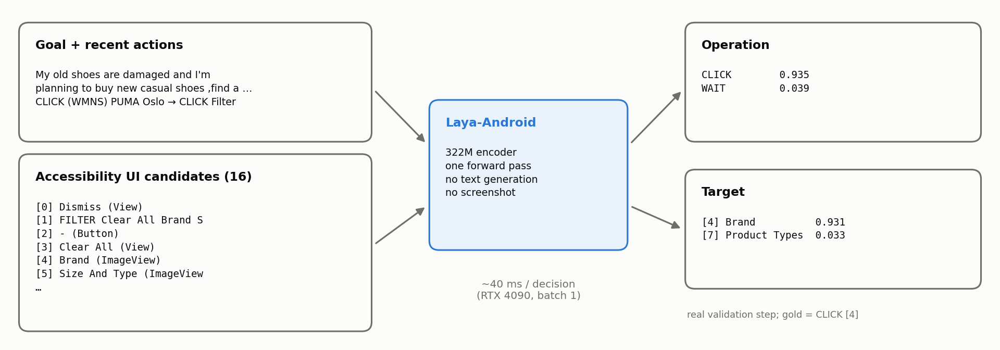

# Model, data and training

## Model

Laya-Android does not propose a new architecture. It fine-tunes [Laya](https://github.com/NandhaKishorM/laya) (Convai Innovations), a non-generative typed-decision model: every option gets a `[MASK]` marker in one sequence, a bidirectional encoder reads goal, state and options together, and a small head scores each marker.



| | |
|---|---|
| Base model | `convaiinnovations/laya`, subfolder `multilingual`, revision `7b928d828b7b0e022f929d9bd2e44165aa270148` |
| Encoder | mmBERT-base; ~322M parameters with the Laya head |
| Laya package | `laya==0.3.28` |
| Sequence budget | `max_len` 3072, `head_max_len` 1536 (no candidate is truncated) |

## Data

AndroidControl only, official `splits.json` / `test_subsplits.json`. Screenshots exist in the dataset but are not used.

- train: 13,594 episodes / 74,714 actions (9 zero-action episodes excluded), plus one synthetic `DONE` per episode → 88,308 steps, 132,448 training items (operation and target questions)
- validation: 137 episodes / 690 actions (827 steps)
- test: four official subsplits (IDD, App-Unseen, Task-Unseen, Category-Unseen), overlapping by design
- statistics: [`results/data/androidcontrol_stats.json`](../results/data/androidcontrol_stats.json)

## Candidates and grounding ([`src/candidates.py`](../src/candidates.py))

1. Visible nodes outside the keyboard window that are clickable, long-clickable, editable, scrollable or checkable; boxes clipped to the screen.
2. Label = own text / content description / hint, else descendant text (≤ 60 chars).
3. Deduplicate on (box, label), keeping the deepest node and OR-ing its flags; order top-to-bottom, left-to-right.
4. A gold tap maps to the smallest containing candidate (then deepest, then lowest index); otherwise the step is ungroundable (kept in history, no target question).

Click grounding coverage: 94.76% on train (44,140 / 46,581), 92.3–95.2% on the test subsplits. Candidates at groundable train clicks: median 15, p99 65, max 246.

## Input

```json
{"goal": "<high-level goal>",
 "history": ["<last 3 actions>"],
 "ui": ["[0] <label> (<class>) <flags>", "..."]}
```

Flags: `edit`, `long`, `scroll`, `on`, `selected`, `disabled`. The same labels are the options of the target question. No screenshot, no step instruction.

## Actions

| AndroidControl action | Laya-Android operation | Arguments produced |
|---|---|---|
| `click` | `CLICK` | target element |
| `long_press` | `LONG_PRESS` | target element |
| `scroll` + direction | `SCROLL_UP` / `SCROLL_DOWN` / `SCROLL_LEFT` / `SCROLL_RIGHT` | direction (in the operation) |
| `input_text` | `INPUT_TEXT` | none: text is not generated |
| `open_app` | `OPEN_APP` | none: app name is not generated |
| `navigate_back` | `BACK` | – |
| `navigate_home` | `HOME` | – |
| `wait` | `WAIT` | – |
| – | `DONE` | – (synthetic end-of-episode label) |

## Training

Supervised fine-tuning with `laya.train` (cross-entropy over options), bf16 autocast, gradient checkpointing, effective batch 32, encoder lr 2.5e-5, head lr 1e-4, cosine schedule, option order shuffled. 3 epochs on one RTX 4090 (2.7 h); no RL, no oversampling, no class weights. The checkpoint is selected by validation Policy Joint and temperatures are fit on validation. Configs: [`configs/`](../configs/).

## Reproduction

```bash
pip install -r requirements.txt
export LAYA_ANDROID_DATA=/path/to/large/disk          # default D:/laya-android

# data (~50GB) into $LAYA_ANDROID_DATA/raw/android_control, then step-level JSONL
B=https://storage.googleapis.com/gresearch/android_control
curl -fLO $B/splits.json && curl -fLO $B/test_subsplits.json
for i in $(seq -w 0 19); do curl -fLO $B/android_control-000$i-of-00020; done
python scripts/build_androidcontrol_dataset.py --workers 10
python scripts/inspect_android_control.py

python scripts/train_laya_android.py configs/full.yaml          # epoch checkpoints kept, best by validation

# one test pass with saved per-step predictions (base and fine-tuned)
S=test_idd,test_app_unseen,test_task_unseen,test_category_unseen
python scripts/eval_laya_android.py --model $LAYA_ANDROID_DATA/checkpoints/laya-android-v0 --splits $S \
    --out results/test/internal_laya_android.json --preds-dir results/test/raw/laya_android
python scripts/eval_base_laya.py --splits $S --out results/test/internal_base_laya.json --preds-dir results/test/raw/base_laya

# AndroidControl-High Type/Grounding from saved predictions (needs InfiX-ai/android_control_test)
python scripts/evaluate_androidcontrol.py --model laya_android --out results/test/final_metrics.json --preds-out results/test/final_predictions.jsonl.gz
python scripts/evaluate_androidcontrol.py --model base_laya --out results/test/base_metrics.json --preds-out results/test/base_predictions.jsonl.gz

python scripts/benchmark_latency.py --out results/latency/rtx4090.json
python scripts/make_figures.py
```
